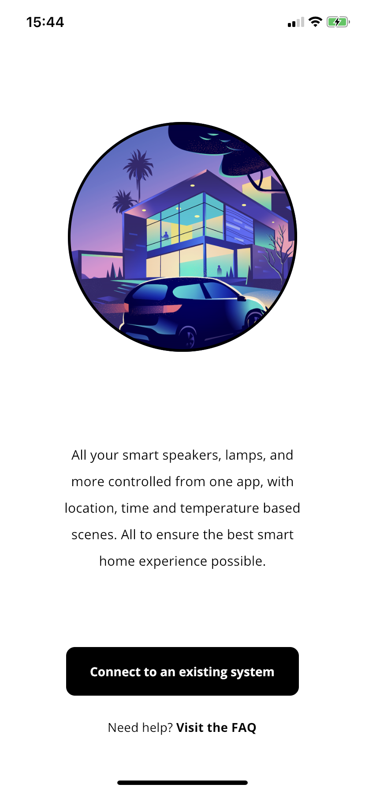
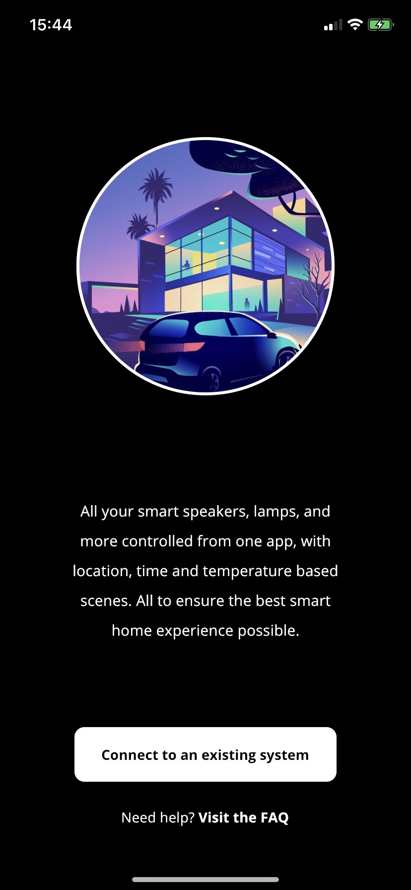
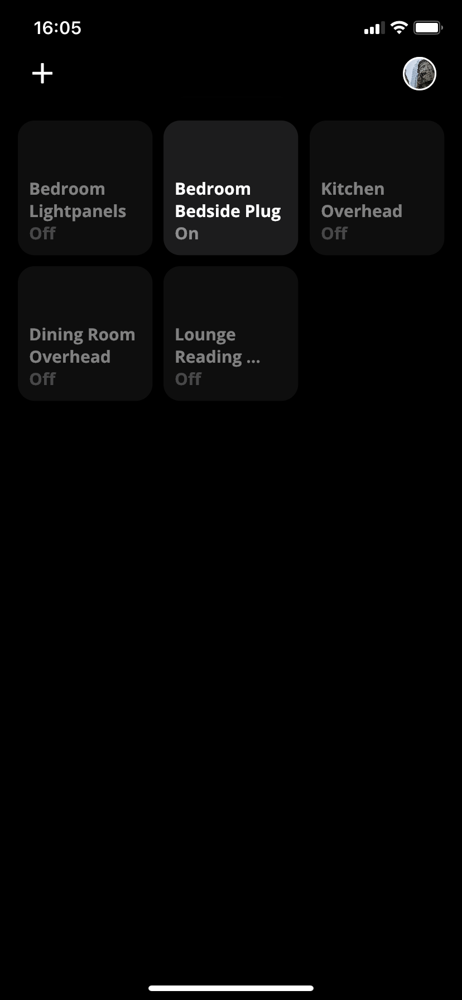
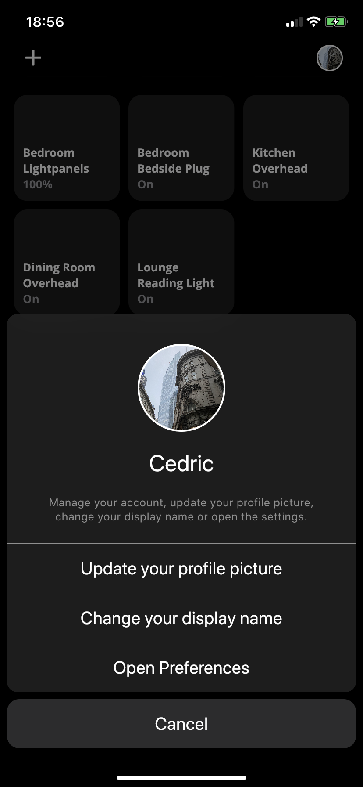

# Home Automation

Home Automation is a distributed smart home system largely written in Go[<sup>1</sup>](#1) and Dart.
It's mostly meant as a learning opportunity rather than a production-ready system.

<kbd></kbd>
<kbd></kbd>
<kbd></kbd>
<kbd></kbd>

## Currently supported controllers

| Controller | Description | Status |
| --- | --- | --- |
| modules.aurora | A controller for Nanoleaf Aurora lightpanels      | Alpha |
| modules.sonoff | A controller for sonoff tasmota lights and plugs  | Alpha |
| modules.sonos  | A controller for all types of sonos speakers      | WIP   |
| modules.hue    | tbd                                               | Planned |

## All services

| Service | Description | Status |
| --- | --- | --- |
| core.api-gateway      | The API Gateway                                   | Alpha |
| core.user             | User management                                   | Alpha |
| core.device-registry  | The Device Registry Service                       | Alpha |
| modules.scene         | The scene controller                              | WIP   |
| modules.schedule      | The schedule controller                           | WIP   |
| modules.aurora        | A controller for Nanoleaf Aurora lightpanels      | Alpha |
| modules.sonoff        | A controller for sonoff tasmota lights and plugs  | Alpha |
| modules.sonos         | A controller for all types of sonos speakers      | WIP   |

## Usage

All responses will be JSON. Individual service's README's will detail the expected JSON value.
Start all docker containers with: `docker-compose up -d --build --force-recreate`

### API Gateway Service

The api gateway service reads data from `core.api-gateway/config.json` and distributes requests accordingly.
Example config.json structure:
```json
{
    "port": ,
    "services": [
        {
            "identifier": "core.device-registry",
            "name": "Device Registry",
            "upstream": "http://core.device-registry:4001"
        },
        {
            "identifier": "modules.sonoff",
            "name": "Sonoff Controller",
            "upstream": "http://modules.sonoff:4002"
        },
        {
            "identifier": "modules.sonos",
            "name": "Sonos Controller",
            "upstream": "http://modules.sonos:4003"
        },
        {
            "identifier": "modules.aurora",
            "name": "Nanoleaf Aurora Controller",
            "upstream": "http://modules.aurora:4004"
        }
    ]
}
```

### Controllers

Controllers must implement a standardised interface for fetching and updating device state.

`GET modules.<controller-identifier>/device/<device-identifier>`

- 200: success

```json
{
    "id": "lightpanels",
    "name": "Desk Lamp",
    "type": "lamp-color",
    "controller": "modules.aurora",
    "state": {
        "brightness": {
            "value": 50,
            "max": 100,
            "min": 0
        },
        "color_mode": "hs",
        "temperature": {
            "value": 4000,
            "max": 6500,
            "min": 1200
        },
        "hue": {
            "value": 123,
            "max": 360,
            "min": 0
        },
        "power": true,
        "saturation": {
            "value": 100,
            "max": 100,
            "min": 0
        }
    }
}
```

```json
{
  "identifier": "bedroom-plug",
  "name": "Bedroom Plug",
  "type": "plug",
  "controller": "modules.hue",
  "state": {
    "power": true
  }
}
```

`PUT modules.<controller-identifier>/device/<device-identifier>`

JSON request body:

```json
{
    "power": true,
    "brightness": {
        "value": 100,
        "duration": 10
    }
}
```

- 204: success

### Errors

An error will be indicated by a non-2xx status code. The response will include a message.

```json
{
  "message": "Description of what went wrong"
}
```

## Contributing
Pull requests are welcome. For major changes, please open an issue first to discuss what you would like to change.

Please make sure to update tests and screenshots as appropriate.

## Credits
This project is based on [Jake Wright](https://github.com/jakewright)'s idea of a home-automation system, his youtube series and his home-automation repo.

## License
[MIT](https://choosealicense.com/licenses/mit/)

---
<sup>1</sup> <a class="anchor" id="1">Core services are required to be written Go, other services, like controllers, may be written in Python or NodeJS.</a>
